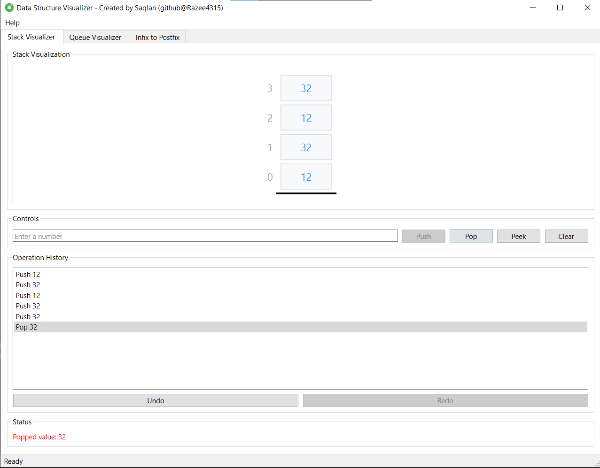
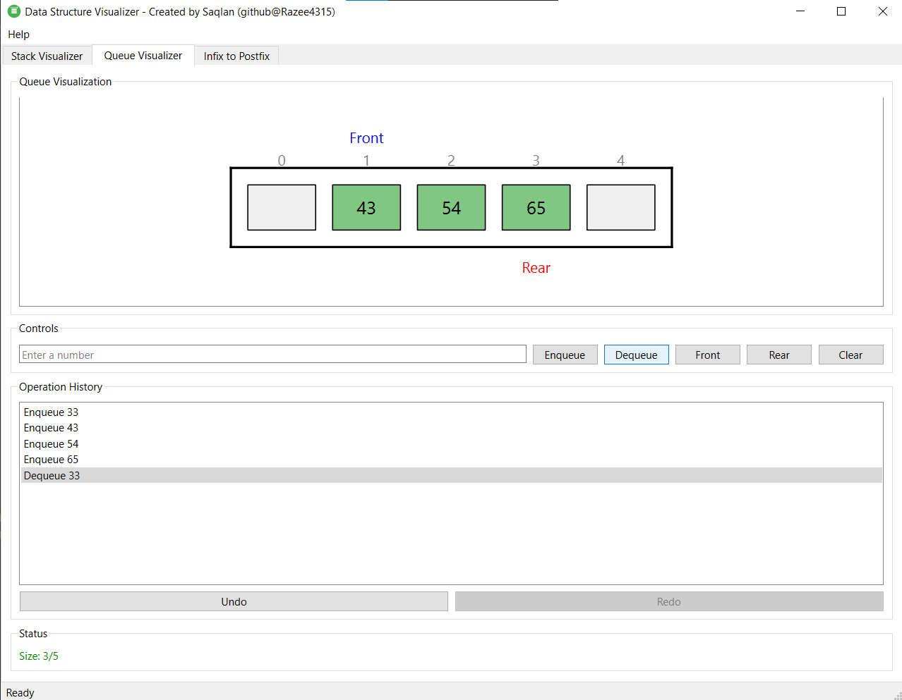
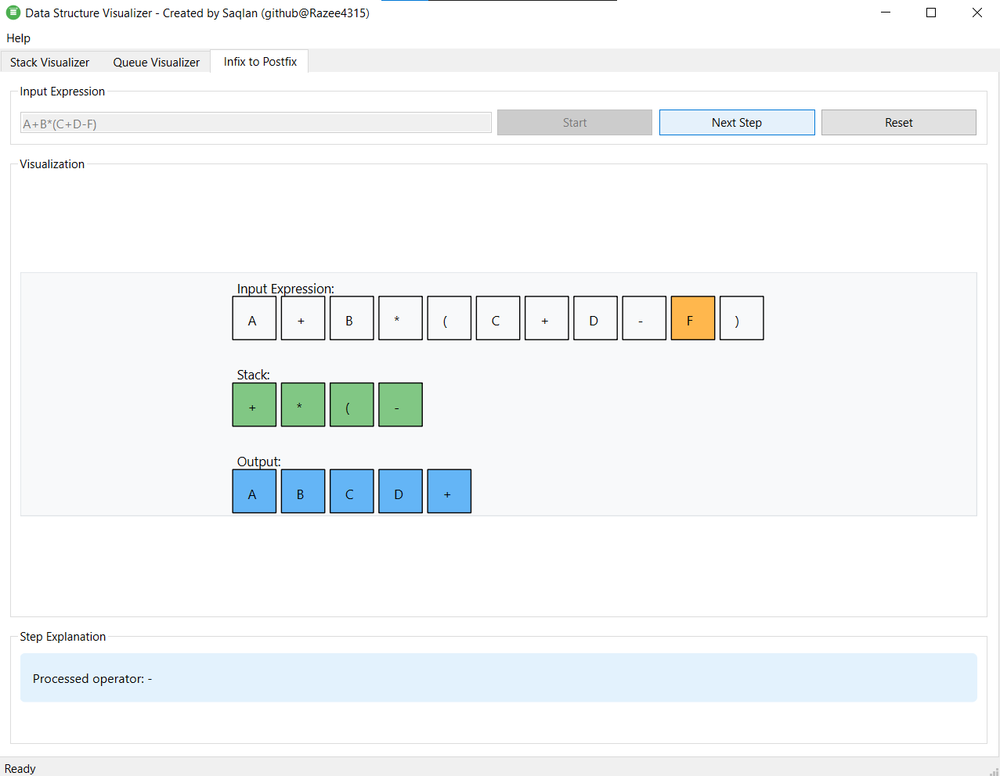

# Data Structure Visualizer

<div align="center">
  
  
  An interactive educational tool for visualizing data structures and algorithms.
  
  [](LICENSE)
  [](https://www.qt.io)
</div>

## Overview

A desktop application built with Qt 6 and C++ that helps students understand data structures through visual representation. Currently supports:

- Stack operations (LIFO) with undo/redo
- Circular Queue implementation
- Infix to Postfix conversion

## Screenshots

<div align="center">
  
  
  
</div>

## Quick Start

```bash
git clone https://github.com/Razee4315/data-structure-visualizer.git
cd data-structure-visualizer
mkdir build && cd build
cmake ..
cmake --build .
```

## Contributing

We welcome contributions! Here are some ways you can help:

### Planned Features
- [ ] Binary Tree Visualization
- [ ] Graph Data Structures
- [ ] Array Sorting Algorithms
- [ ] Linked List Operations
- [ ] Custom Themes
- [ ] More Animation Options

### How to Contribute
1. Fork the repository
2. Create your feature branch (`git checkout -b feature/AmazingFeature`)
3. Commit your changes (`git commit -m 'Add some AmazingFeature'`)
4. Push to the branch (`git push origin feature/AmazingFeature`)
5. Open a Pull Request

## Requirements
- Qt 6.0+
- C++17
- CMake 3.16+

## License

This project is licensed under the MIT License - see the [LICENSE](LICENSE) file for details.

## Author
Created by [Saqlan](https://github.com/Razee4315)
